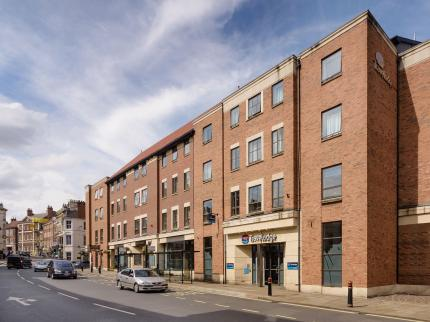
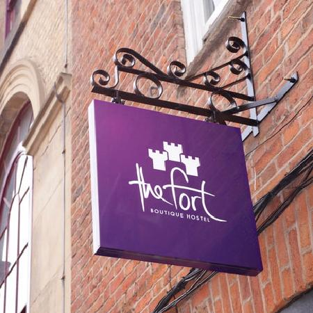

<!-- Main -->

<!-- One -->
<section id="one">
	

		<header class="major">
			<h2>Hotels</h2>
		</header>
		As much as we would love to host all of you, we cannot do it short of putting all of you in a very uncomfortable state.   
     
    This is where you will find the best options to stay in York based on distance and price.
	

</section>

<!-- Two -->
<section id="two" class="spotlights">
	<section>
		
		

			

				<header class="major">
					<h3>£££ - The Judge's Lodging</h3>
				</header>
				
Location: 1 min walk from the garden

				
Price: £120-130/night

				<ul class="actions">
					<li><a target='_blank' rel='noreferrer noopener' href="https://www.thwaites.co.uk/hotels-and-inns/inns/judges-lodging-at-york/#" class="button">Learn more</a></li>
				</ul>
			

		

	</section>
	<section>
		
		

			

				<header class="major">
					<h3>££ - Travelodge Micklegate</h3>
				</header>
				
Location: Micklegate, 10 minutes walk from the garden

				
Price: £90-110/night

				<ul class="actions">
					<li><a target='_blank' rel='noreferrer noopener' href="https://www.travelodge.co.uk/hotels/422/York-Central-Micklegate-hotel" class="button">Learn more</a></li>
				</ul>
			

		

	</section>
	<section>
		
		

			

				<header class="major">
					<h3>£ - The Fort Boutique Hostel</h3>
				</header>
				
Location: Stonegate, 5 minutes walk from the garden

				
Price: £75-90/night

				<ul class="actions">
					<li><a target='_blank' rel='noreferrer noopener' href="https://www.thefortyork.co.uk/" class="button">Learn more</a></li>
				</ul>
			

		

	</section>
</section>

<!-- Three -->
<section id="three">
	

		<header class="major">
			<h2>So many options</h2>
		</header>
		
York has a huge number of places to stay, including a lot of very nice B&Bs with only a few rooms each, so by all means use our suggestions above, but we do recommend having a look for yourself - you might find a hidden treasure!

		<ul class="actions">
			<li><a href="https://www.google.co.uk/search?q=rooms+in+york" class="button next">Take a Look</a></li>
		</ul>
	

</section>

